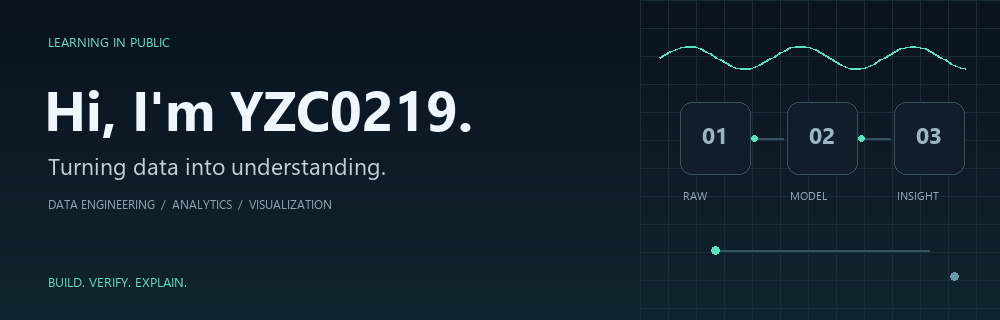
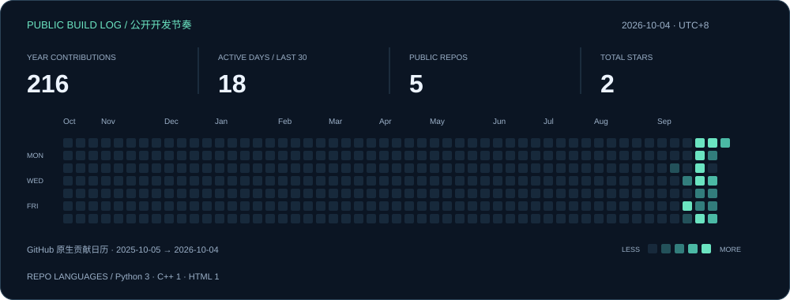

  <a href="https://github.com/YZC0219/industrial_energy_analysis">能迹 EnergyTrace</a>　/　
  <a href="https://yzc0219.github.io/industrial_energy_analysis/">在线作品 ↗</a>　/　
  <a href="https://github.com/YZC0219?tab=repositories">全部项目</a>

## 你好，我是 YZC0219

**大数据专业学生，正在把数据工程、分析和可视化串成完整的项目。**

我喜欢从一个具体问题出发：数据为什么不一致？异常来自业务还是清洗？图表上的结论能否追溯到原始记录？在 AI 辅助开发中，我通过提出问题、检查结果、复现流程和排查错误，逐步理解实现。

目前围绕工业能耗场景持续完善 **EnergyTrace**，也在探索运营数据与公共数据的可视化表达。

| BUILD · 建立链路 | VERIFY · 核验结果 | EXPLAIN · 讲清结论 |
|---|---|---|
| Python 清洗、SQL 分析、数据建模 | 查询快照、质量规则、回归检查 | 交互报告、指标口径、工程复盘 |

## 代表作品

### 01 / 能迹 EnergyTrace

**从能源记录到可解释的业务洞察。**

8 个车间、6 种能源、731 天的基础模拟数据，覆盖清洗、MySQL 星型模型、29 组 SQL 分析、预测与异常证据、交互报告。正在扩展语义层、诊断反馈和持久化告警。

[查看源码 →](https://github.com/YZC0219/industrial_energy_analysis)　[打开报告 ↗](https://yzc0219.github.io/industrial_energy_analysis/)　[阅读工程复盘 →](https://github.com/YZC0219/industrial_energy_analysis/blob/main/docs/问题发现与工程复盘.md)

### 02 / 可视化探索

| 项目 | 方向 |
|---|---|
| [年度流感监测大屏](https://github.com/YZC0219/annual-influenza-dashboard) | 年份、地区、年龄组筛选与公共数据展示 |
| [生产运营看板](https://github.com/YZC0219/production-operations-dashboard) | 生产运营数据看板项目 |

## 正在学习与实践

  
  
  
  
  

进一步探索：Hive / Spark / DataX 分层数仓、Airflow 编排、Kafka / Flink 实时实验、FastAPI 与 BI，以及时序预测和模型证据核验。

项目中的单机实验、模拟结果与真实数据案例都有各自适用范围。我希望展示的不只是功能，也包括排查过程、验证方法和还没解决的问题。

## 公开开发动态

<!-- ACTIVITY:START -->
最后刷新：**2026-10-04 · Asia/Shanghai**

| 最近有推送的项目 | 推送日期（上海时间） |
|---|---|
| [industrial_energy_analysis](https://github.com/YZC0219/industrial_energy_analysis) | 2026-10-04 |
| [production-operations-dashboard](https://github.com/YZC0219/production-operations-dashboard) | 2026-09-22 |
| [-](https://github.com/YZC0219/-) | 2026-09-18 |
<!-- ACTIVITY:END -->

这个页面如何更新？

顶部是仓库内的循环 GIF 动画，数据卡片和最近更新项目由 GitHub Actions 每日读取公开 GitHub API 后生成，也支持手动刷新。统计仅覆盖公开、非 Fork 仓库；语言统计按仓库主要语言计数，最近更新按仓库推送时间排列，不代表当天提交数。缓存可能让图片稍晚更新。

[刷新记录](https://github.com/YZC0219/YZC0219/actions/workflows/refresh-profile.yml) · [生成脚本](scripts/update_profile.py)

从数据出发，让每一个结论有据可查。 LEARNING IN PUBLIC · BUILDING WITH EVIDENCE

