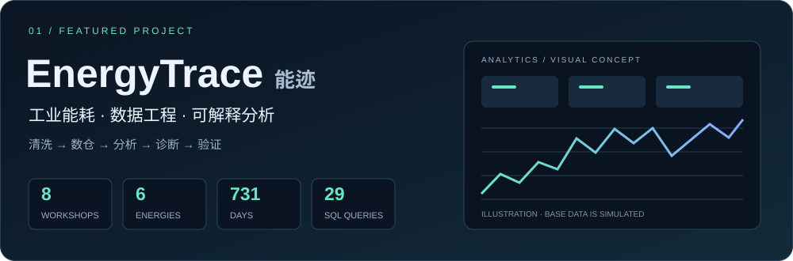
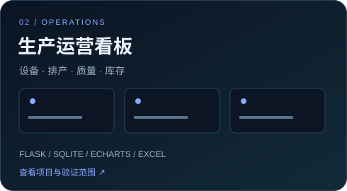
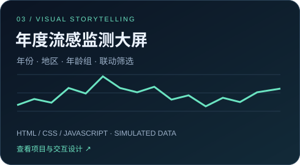
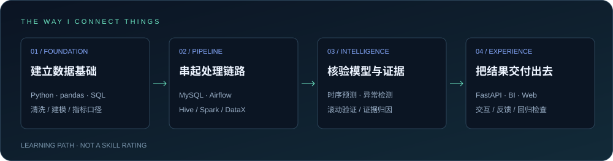
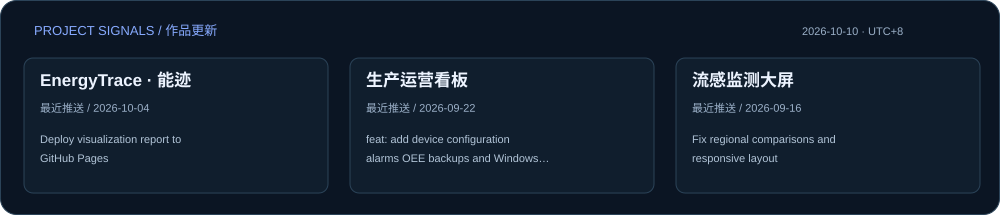

  <picture>
    <source media="(prefers-color-scheme: dark)" srcset="assets/chat-dark.svg" />
    
  </picture>

  <picture>
    <source media="(prefers-color-scheme: dark)" srcset="assets/typing-dark.svg" />
    
  </picture>

  <a href="https://github.com/YZC0219/industrial_energy_analysis"><strong>探索 EnergyTrace</strong></a>　✦　
  <a href="https://yzc0219.github.io/industrial_energy_analysis/"><strong>打开在线作品 ↗</strong></a>　✦　
  <a href="https://github.com/YZC0219?tab=repositories">浏览全部仓库</a>

  
  
  

## 01 / ABOUT　把问题变成可以验证的答案

你好，我是 **YZC0219**，一名大数据专业学生。现在围绕工业能耗与生产运营场景，把数据清洗、数仓建模、统计分析和交互展示串成完整作品。

我喜欢追问数据背后的细节：**异常来自业务还是清洗？任务成功后，结果真的更新了吗？图表上的结论能否追溯到原始记录？** 这些问题逐渐变成了我的项目习惯：先定义口径，再复现流程，用证据检查结果，最后把结论讲清楚。

开发过程中，我使用 AI 辅助实现，通过提出问题、审查结果、复现和排错逐步理解代码。这里也记录那些让我真正学到东西的错误、修复和未完成事项。

> **目前的关注点**：工业数据链路的可靠性、异常与预测的证据核验，以及数据产品的交互表达。

## 02 / SELECTED WORK　从一个场景持续深入

**能迹 EnergyTrace** 是我目前持续完善的主项目。从主动构造脏数据开始，经过可追溯清洗、MySQL 星型模型与 SQL 分析，交付交互报告，再向分层数仓、时序预测、实时管道和诊断反馈扩展。

| 建立链路 | 核验结果 | 交付洞察 |
|---|---|---|
| 清洗留痕、幂等装载、历史修正 | 29 组查询快照、质量门禁、回归检查 | 能耗 / 单耗 / 费用 / 碳排放分析 |
| Hive / Spark / DataX、Airflow | 三引擎对照、迟到数据修正实验 | 报告、FastAPI、Metabase 与统一指标 |
| Kafka / Flink 与持久化告警 | 故障注入、恢复、重放与对账 | 异常证据问答、人工处置与历史记录 |

[源码与运行说明 →](https://github.com/YZC0219/industrial_energy_analysis)　[交互报告 ↗](https://yzc0219.github.io/industrial_energy_analysis/)　[工程复盘 →](https://github.com/YZC0219/industrial_energy_analysis/blob/main/docs/问题发现与工程复盘.md)

  
  

- **生产运营看板**：围绕设备、排产、质量和库存，加入 Excel 导入校验、角色权限、告警与运行维护入口。功能与实机验证范围以仓库说明为准。
- **年度流感监测大屏**：探索月度趋势、地区分布、年龄组对比与联动筛选；数值为模拟数据，用于展示设计和交互。

## 03 / TOOLBOX　我正在连接的技术

<!-- TOOLBOX:START -->
### 数据分析与建模

<table align="center">
  <tr>
    <td align="center" width="140"> Python</td>
    <td align="center" width="140"> pandas</td>
    <td align="center" width="140"> NumPy</td>
    <td align="center" width="140"> SciPy</td>
  </tr>
  <tr>
    <td align="center" width="140"> MySQL</td>
    <td align="center" width="140"> SQLite</td>
    <td align="center" width="140"> Scikit-learn</td>
    <td align="center" width="140"> LightGBM</td>
  </tr>
  <tr>
    <td align="center" width="140"> PyTorch</td>
    <td align="center" width="140"> SHAP</td>
    <td align="center" width="140"> Matplotlib</td>
    <td align="center" width="140"> ECharts</td>
  </tr>
</table>

PyTorch 与深度模型按可选依赖启用；ECharts 用于生产运营看板。

### 数仓与实时处理

<table align="center">
  <tr>
    <td align="center" width="140"> Hadoop</td>
    <td align="center" width="140"> Hive</td>
    <td align="center" width="140"> Spark</td>
    <td align="center" width="140"> DataX</td>
  </tr>
  <tr>
    <td align="center" width="140"> Airflow</td>
    <td align="center" width="140"> Kafka</td>
    <td align="center" width="140"> Flink</td>
    <td align="center" width="140"> Iceberg</td>
  </tr>
  <tr>
    <td align="center" width="140"> ClickHouse</td>
    <td align="center" width="140"> Redis</td>
    <td align="center" width="140"> Metabase</td>
    <td align="center" width="140"> Great Expectations</td>
  </tr>
</table>

分层数仓、实时处理与湖仓扩展的单节点 / 本机实验；运行方式和验证范围见主项目文档。

### 服务、前端与工程工具

<table align="center">
  <tr>
    <td align="center" width="140"> FastAPI</td>
    <td align="center" width="140"> Flask</td>
    <td align="center" width="140"> Uvicorn</td>
    <td align="center" width="140"> PostgreSQL</td>
  </tr>
  <tr>
    <td align="center" width="140"> HTML</td>
    <td align="center" width="140"> CSS</td>
    <td align="center" width="140"> JavaScript</td>
    <td align="center" width="140"> openpyxl</td>
  </tr>
  <tr>
    <td align="center" width="140"> Docker</td>
    <td align="center" width="140"> Linux</td>
    <td align="center" width="140"> PowerShell</td>
    <td align="center" width="140"> Git</td>
  </tr>
  <tr>
    <td align="center" width="140"> GitHub</td>
    <td align="center" width="140"> GitHub Actions</td>
    <td align="center" width="140"> pytest</td>
    <td align="center" width="140"> Playwright</td>
  </tr>
</table>

PostgreSQL 用于 Airflow 元数据库；openpyxl 支持看板 Excel 导入；pytest / Playwright 用于回归与浏览器验收。

图标表示项目涉及的技术与工具，不代表熟练度评级；部分扩展需要独立环境或可选依赖。

<!-- TOOLBOX:END -->

<strong>展开我的实践方向与下一步</strong>

| 方向 | 已在项目中尝试 | 接下来想做 |
|---|---|---|
| 数据工程 | 星型模型、分层数仓、增量修正、CDC 与调度 | 更完整的独立复现、故障恢复和运行保障 |
| 模型与证据 | 滚动时序验证、异常检测、证据归因 | 接入真实事件标签，检查跨数据场景的适用性 |
| 数据产品 | 网页报告、BI、诊断工作台与反馈 | 完善筛选语义、交互体验和处置流程 |

这些是学习与实践方向。单节点实验、模拟结果、真实数据案例都有各自适用范围；生产部署、真实节能效果与多节点高可用尚需进一步验证。

## 04 / FIELD NOTES　错误也是项目的一部分

**01 · 一次清洗修复。** 删除离群值整行，让 34 个“车间 × 日期”缺少能源品种，随后产生假异常。改为异常单元格置空再插补，缺失品种的车间日降到 0，并用回归测试固化。

**02 · 一次链路排查。** 新数据进入事实表，报告却没变：日期维表未覆盖新增日期，`INNER JOIN` 过滤了记录。这个问题让我学会同时检查任务状态、数据覆盖与最终结果。

[完整工程复盘 →](https://github.com/YZC0219/industrial_energy_analysis/blob/main/docs/问题发现与工程复盘.md)　[两个月学习计划 →](https://github.com/YZC0219/industrial_energy_analysis/blob/main/docs/两个月项目学习计划.md)

## 05 / BUILD LOG　让持续投入看得见

<strong>让每一天的贡献，连成一条前进的轨迹。</strong>

<picture>
  <source media="(prefers-color-scheme: dark)" srcset="assets/snake-dark.svg" />
  
</picture>

查看最新提交与统计说明

<!-- ACTIVITY:START -->
最近刷新：**2026-10-08 · Asia/Shanghai**。贡献日历与作品更新每天自动同步。

- [EnergyTrace · 能迹](https://github.com/YZC0219/industrial_energy_analysis) · 2026-10-04 · [Deploy visualization report to GitHub Pages](https://github.com/YZC0219/industrial_energy_analysis/commit/4a79a5be4c556b6f7005b038df09480859baedfa)
- [生产运营看板](https://github.com/YZC0219/production-operations-dashboard) · 2026-09-22 · [feat: add device configuration alarms OEE backups and Windows service](https://github.com/YZC0219/production-operations-dashboard/commit/fc717abab31017fb149fc3b3b399c8e37e263734)
- [流感监测大屏](https://github.com/YZC0219/annual-influenza-dashboard) · 2026-09-16 · [Fix regional comparisons and responsive layout](https://github.com/YZC0219/annual-influenza-dashboard/commit/2b04b47e2378c8705b38af365e5d658ace48485d)
<!-- ACTIVITY:END -->

贡献热力图来自 GitHub 原生贡献日历，覆盖过去一年；贡献并不等同于提交次数。仓库统计覆盖公开、非 Fork 仓库，语言按仓库主要语言计数。作品卡片展示精选项目的推送日期与最新提交主题。

页面每日通过 GitHub Actions 刷新，也支持手动触发。聊天气泡、循环打字与作品卡图表是原创视觉设计；统计区与贡献贪吃蛇使用真实 GitHub 数据，更新失败时保留之前版本。[查看刷新记录](https://github.com/YZC0219/YZC0219/actions/workflows/refresh-profile.yml) · [查看生成脚本](scripts/update_profile.py)

查看数据实验室动画与组件来源

聊天气泡与打字：[生成源码](scripts/create_social_assets.py)。实验室动画：[生成源码](scripts/create_intro.py)。贡献贪吃蛇：[Platane/snk](https://github.com/Platane/snk)。技术图标：[TechStack Generator](https://techstack-generator.vercel.app/)、[Skill Icons](https://github.com/tandpfun/skill-icons)、[Devicon](https://github.com/devicons/devicon) 与 [Simple Icons](https://github.com/simple-icons/simple-icons)。少数工具使用原创缩写标识；来源见[图标说明](assets/icons/NOTICE.md)。

---

<strong>从数据出发，让每一个结论有据可查。</strong> ASK BETTER QUESTIONS. BUILD THOUGHTFULLY. KEEP LEARNING.

